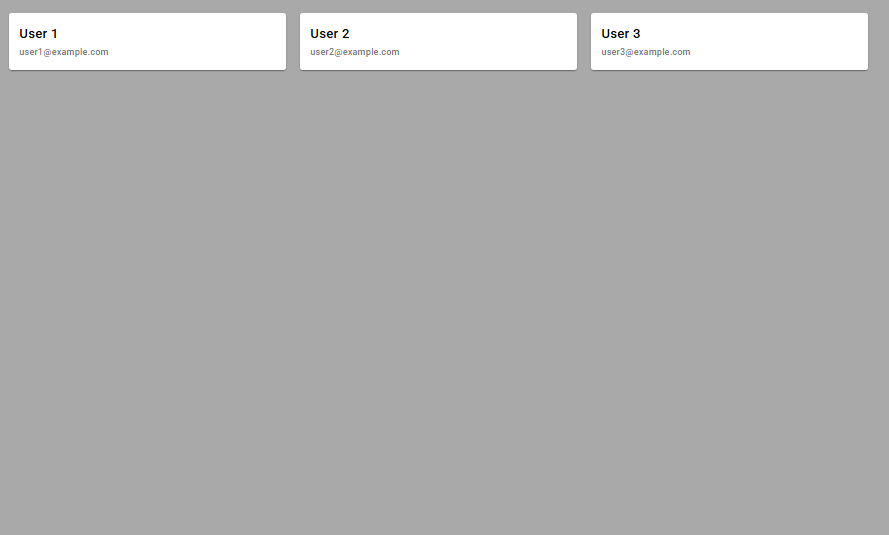
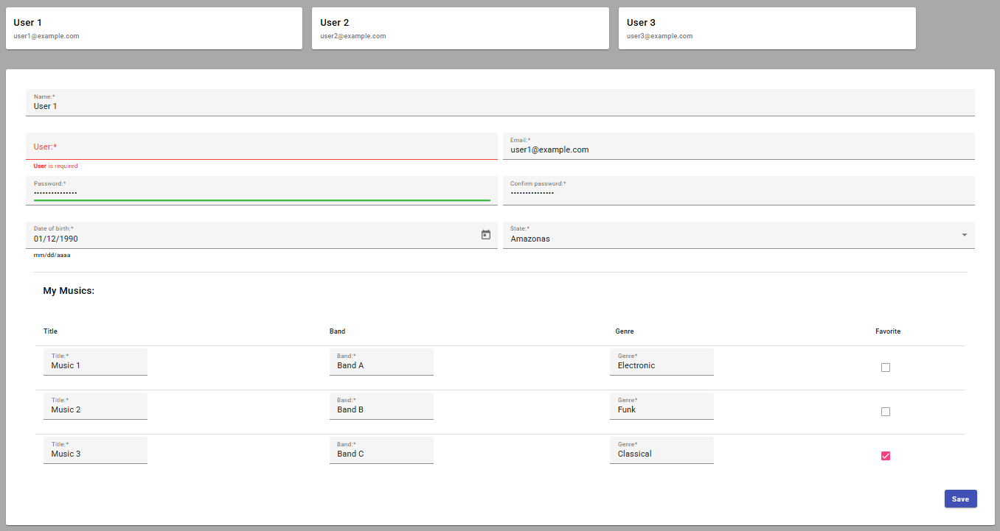

# UserRegistrationProject

This project was generated with [Angular CLI](https://github.com/angular/angular-cli) version 17.0.10.

## Development server

Run `ng serve` for a dev server. Navigate to `http://localhost:4200/`. The application will automatically reload if you change any of the source files.

## 🧩 Technologies and Concepts Used

This project applies several Angular and TypeScript concepts to ensure clean architecture, strong typing, and maintainable code. Below is a summary of all key features implemented.

## 📌 Template-Driven Forms

Used to build and validate forms directly in the template using ngModel.
Provides quick setup, simple validation, and declarative form control.

## 🗂 Project Organization

The project is structured into clear folders such as:

components/

services/

pipes/

directives/

interfaces/

types/

utils/

## 🔄 Pipes

Custom pipes are used to format and transform data directly in the template without altering its original structure.

## 🎯 Custom Directives

Custom directives were created to add reusable behaviors to HTML elements, such as custom validations or dynamic visual changes.

## 📡 Observables

Observables (RxJS) are used for handling asynchronous data, events, and reactive programming flows across the application.

## 🧾 Interfaces

Interfaces define strict and predictable data structures for models, components, and services.
This ensures safer and more transparent type usage throughout the project.

⚙️ Services

Services centralize business logic, handle data processing, and communicate with APIs or shared application layers.

## 🔤 Custom Types

Custom TypeScript types are used to increase flexibility while still providing type safety, improving both readability and maintainability.

## 📦 Modularization

The application is organized into Angular modules, enabling:

Cleaner imports

Feature separation

Reusability

Better scalability

## 🔁 Lifecycle Hooks

Lifecycle hooks are used to control component behavior at specific moments.

ngOnInit — Initializes data or sets up initial logic.
ngOnChanges — Reacts to changes in @Input() properties.

🧷 Object Cloning with structuredClone

The native structuredClone() function is used to create deep copies of objects, ensuring immutability and preventing unintended side effects when handling complex data structures.

Display of the initial cards. When clicked, a form appears with the fields pre-filled based on the selected card.

Form with registration fields using Angular Material components such as mat-form-field, mat-error, and ng-container
